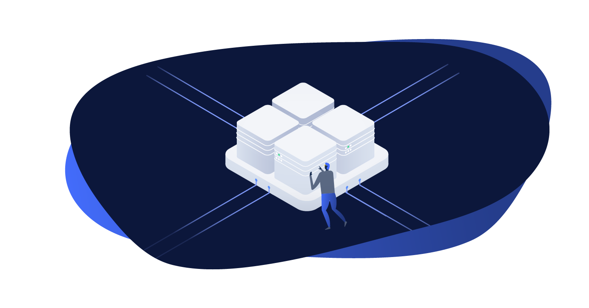

# Local Server



**Note:** Local Server is an experimental Docker-based environment, currently in preview. Consult the [Local Chassis](docs://local-chassis) documentation if you are using Chassis for your local environment.

The Local Server module providers a local development environment for Altis projects. It is built on a containerized architecture using Docker images and Docker Compose to provide drop-in replacements for most components of the Cloud infrastructure.

## Installing

Local Server uses Docker for containerization, therefore you must install the Docker runtime on your computer as a prerequisite. Download and install Docker for your OS at [https://www.docker.com/get-started](https://www.docker.com/get-started).

Once Docker is installed and running, you are ready to start the Local Server. Local Server uses the command line via the `composer` command.

Navigate your shell to your project's directory. You should already have installed Altis by running `composer install` or `composer create-project` but if not, do so now.

## Starting the Local Server

To start the Local Server, simply run `composer local-server start`. The first time you run this it will download all the necessary Docker images.

Once the initial install and download has completed, you should see the output:

```sh
Startup completed.
To access your site visit: https://my-site.altis.dev/
```

Visiting your site's URL should now work. Visit `/wp-admin/` and login with `admin` / `admin` to get started!

The subdomain used for the project can be configured via the `modules.local-server.name` setting:

```json
{
	"extra": {
		"altis": {
			"modules": {
				"local-server": {
					"name": "my-project"
				}
			}
		}
	}
}
```

## Available Commands

* `composer server start` - Starts the container.
* `composer server stop` - Stops the containers.
* `composer server restart` - Restart the containers.
* `composer server destroy` - Stops and destroys all containers.
* `composer server status` - Displays the status of all containers.
* `composer server logs <service>` - Tail the logs from a given service, defaults to `php`, available options are `nginx`, `php`, `db`, `redis`, `cavalcade`, `tachyon`, `s3` and `elasticsearch`.
* `composer server shell` - Logs in to the PHP container.
* `composer server cli -- <command>` - Runs a WP CLI command, you should omit the 'wp' for example `composer server cli -- info`
